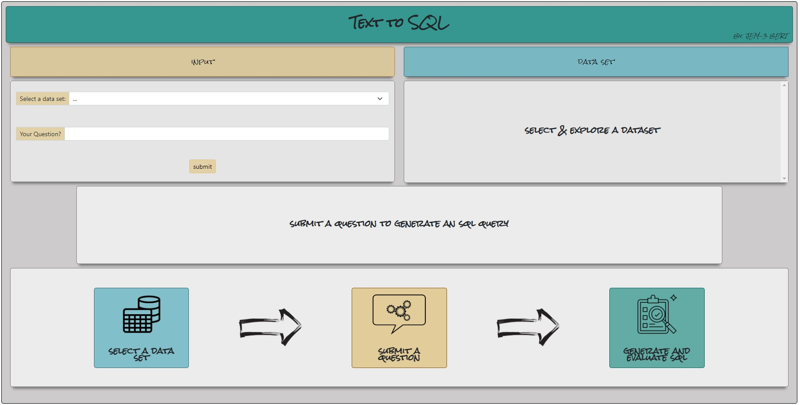
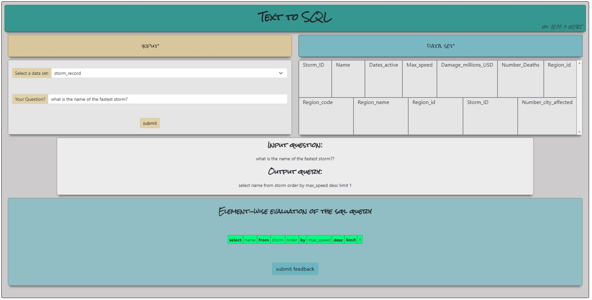
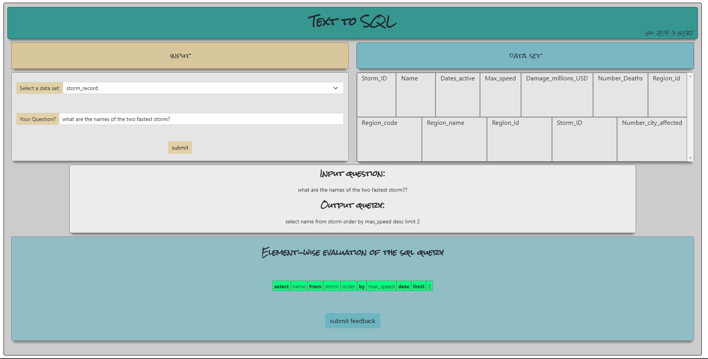
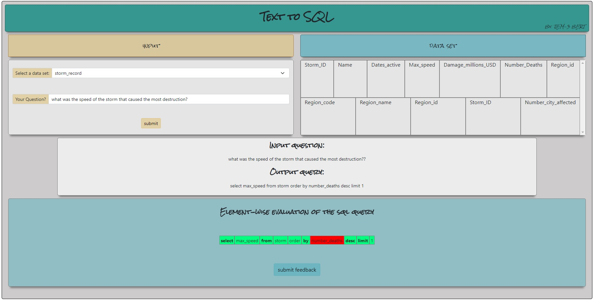
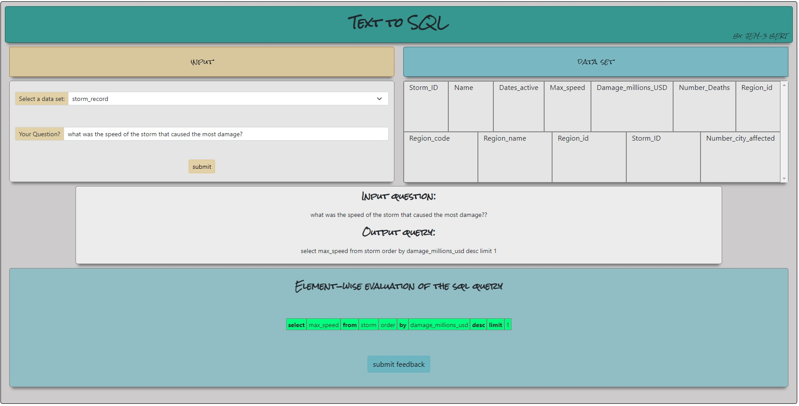

# TextToSQL

## Abstract 

Text-to-SQL systems are a subdomain of semantic parsing that involves converting natural 
language (NL) into SQL queries to enable easy interaction with databases. There are many existing
architectures that have produced impressive results for converting NL to SQL queries. However, 
there is still much to be learned about the errors that occur in test-to-SQL systems
and exploring uncertainty in the models. In this project, my project teammates and I intended to 
evaluate model uncertainty and explore error detection methods for state-of-the-art text-to-SQL systems.

## Web App

My team's text-to-SQL model is an innovative solution that allows users to enter natural language 
queries through a graphical user interface (GUI), improving the user experience and making the 
process more intuitive. The model is based on the state-of-the-art Spider model, which generates 
SQL queries directly from natural language input using a combination of sequence-to-sequence and 
sequence-to-action models.

One of the key advantages of our product is its potential to leverage semi-supervised learning to
improve its accuracy in handling complex queries in the future. By gathering user feedback 
through the GUI, our model can be trained to handle more diverse and complex queries over time. 

The Spider model, on which our text-to-SQL model is based, has already demonstrated 
state-of-the-art performance on the Spider benchmark, with an exact matching accuracy of 56.8% 
and an execution accuracy of 82.9%. This makes it a promising tool for improving the usability 
of SQL queries, particularly for non-expert users.

In conclusion, our text-to-SQL model is an exciting development that has the potential to improve 
the usability of SQL queries and reduce the barrier to entry for non-expert users. With the 
inclusion of semi-supervised learning and user feedback, it has the potential to become even 
more accurate and efficient in handling complex queries over time, leveraging the strengths of the Spider model.

Start screen:

Below are two showcases for short queries:

Here are two showcases for longer queries and interpretative edge cases. The top screenshot also 
shows the 'feedback' feature that allows the user to provide information about incorrect parts of the 
query. This information is stored server side and will be the foundation for a semi-supervised 
model in the future.

----------------

## Running the Web App locally:

$ export FLASK_APP=application.py

$ python -m flask run
 
-> Running on http://127.0.0.1:5000/

----------------
